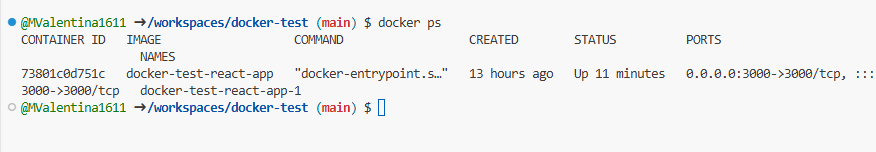
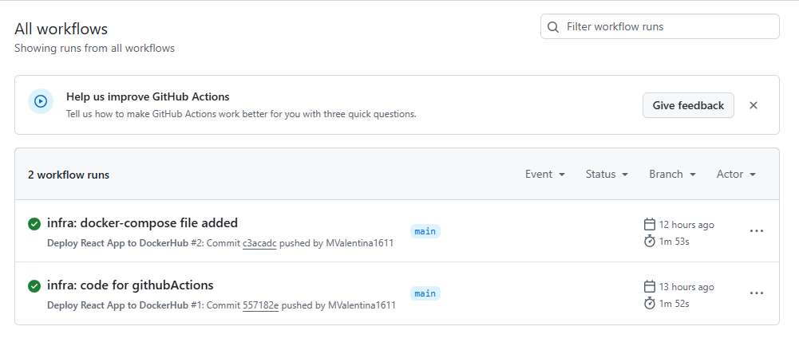
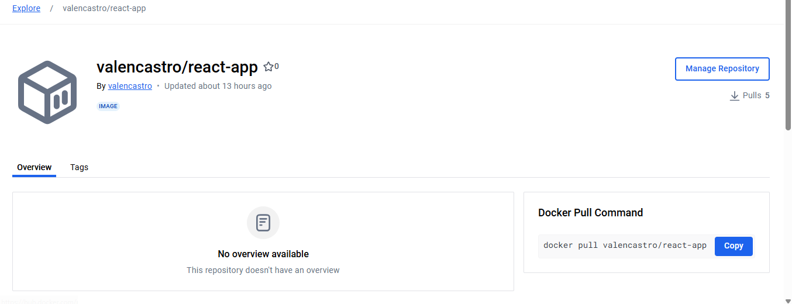
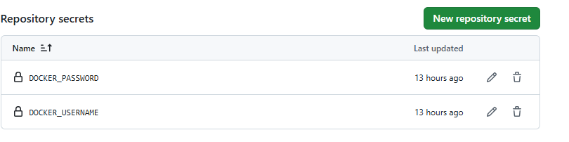
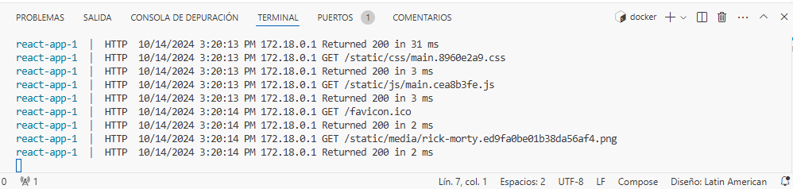

# 🚀 Proyecto React con Docker y GitHub Actions

## 📋 Descripción

Este proyecto contiene una aplicación de React que está dockerizada y configurada para desplegarse automáticamente utilizando **GitHub Actions**. El objetivo es que, al hacer un push al repositorio, la imagen de Docker se construya y se suba automáticamente a **Docker Hub**.

## 🛠️ Pasos para el despliegue automático

### 1. 🐳 Configuración de Docker
Se creó un `Dockerfile` para construir la aplicación de React y exponerla en el puerto 3000. El contenido del `Dockerfile` es el siguiente:

```dockerfile
# Usa una imagen base de Node
FROM node:14

# Establece el directorio de trabajo
WORKDIR /app

# Copia los archivos de package.json y package-lock.json
COPY package*.json ./

# Instala las dependencias
RUN npm install

# Copia todo el código de la aplicación al contenedor
COPY . .

# Compila la aplicación de React
RUN npm run build

# Expone el puerto 3000
EXPOSE 3000

# Ejecuta la aplicación
CMD ["npm", "start"]
```

### 2. 📦 Configuración de Docker Compose
Para simplificar el proceso de levantar el contenedor, se creó el siguiente archivo `docker-compose.yml`:

```yaml
version: "3.8"
services:
  react-app:
    build: .
    ports:
      - "3000:3000"
```



### 3. 🤖 GitHub Actions
Se creó un archivo `.yml` dentro del directorio `.github/workflows/` que configura una pipeline de **GitHub Actions** para construir la imagen de Docker y subirla a **Docker Hub** cuando se haga un push a la rama `main`.

```yaml
name: Build and Push Docker Image

on:
  push:
    branches:
      - main

jobs:
  build:
    runs-on: ubuntu-latest

    steps:
    - name: Checkout code
      uses: actions/checkout@v2

    - name: Set up Docker Buildx
      uses: docker/setup-buildx-action@v1

    - name: Log in to Docker Hub
      uses: docker/login-action@v1
      with:
        username: ${{ secrets.DOCKER_USERNAME }}
        password: ${{ secrets.DOCKER_PASSWORD }}

    - name: Build and push Docker image
      uses: docker/build-push-action@v2
      with:
        context: .
        push: true
        tags: tu-usuario-docker-hub/docker-test:latest
```




#### :key: Creación de Secretos en Github
Los secretos se utilizan para gestionar de forma segura información sensible.

Uso de secretos en el repositorio:
DOCKER_USERNAME: Almacena el nombre de usuario de Docker Hub.
DOCKER_PASSWORD: Almacena la contraseña o token de acceso a Docker Hub.
Estos secretos se usan dentro del pipeline de GitHub Actions para autenticarse en la cuenta de Docker Hub al momento de construir y subir la imagen de Docker. De esta manera, los comandos como docker login pueden acceder a los secretos para autenticar sin que las credenciales queden expuestas en el repositorio público.



### 4. 🌐 Acceso a la aplicación
Una vez que la imagen se ha construido y subido a Docker Hub, se levanta el contenedor con el siguiente comando:

```bash
docker-compose up
```




Esto levantará el contenedor en el puerto 3000. Se accede a la aplicación desde el navegador usando `http://localhost:3000`.

## ✅ Conclusión

El proyecto está configurado para un flujo de **CI/CD** sencillo, donde cada cambio en la rama `main` despliega automáticamente la aplicación en Docker Hub, y permitiendo levantarla en cualquier entorno utilizando Docker Compose.


